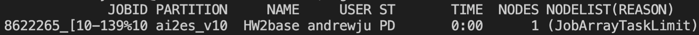

General GPU Tips
================

++++++++++
Background
++++++++++

Having access to these amazing machines is truly a privelage. Please consider the tips and best practices listed here 
to make sure you are not hogging all the computing time to yourself. 

++++++++++++++++++++++++++
Understanding AI2ES Nodes
++++++++++++++++++++++++++

As of 18 May 2022, AI2ES has a total of 12 GPUs that we can use. More specifically, 
we have 2 NVIDIA TESLA V100s which each have their own node (c314 and c315) and 8 NVIDIA A100s 
that are split across 3 nodes (c731, c732 and c733). c731 has 2 A100s, while c732 
and c733 both have 4 GPUs attached to them. The V100s have 32 GB of RAM while the A100s have 40 GB of RAM. 
The V100s are about half as fast as the A100s, so keep that in mind if you notice speed differences between then nodes.

In order to request ANY of the nodes available, add the following line of code to your sbatch file

.. code-block:: console

    #SBATCH -p ai2es

The priorty list for this command will be c314, c315, c731, c732 and then c733. So usually you will
get allocated the V100s first. 

If you want to specifcally get the V100 add the following

.. code-block:: console

    #SBATCH -p ai2es_v100

Alternatively, if you want to specifcally get the A100 add the following

.. code-block:: console

    #SBATCH -p ai2es_a100

If you want to specifcally get the A100 with 2 GPUS do the following

.. code-block:: console

    #SBATCH -p ai2es_a100_2

Or if you want to specifcally get the A100 with 4 GPUS do the following

.. code-block:: console

    #SBATCH -p ai2es_a100_4

+++++++++++++
Sharing GPUs 
+++++++++++++

Now that you have figured out how to request a gpu node with sbatch, it is important to only use the 
number of GPUs you NEED. A100s are a very valuable GPU and are some of the fastest GPUs out there for 
deep learning. So you could see how requesting all 4 of them at time (for c732 and c733) and only using 1
of them is a waste of computational hours. 

By default, tensorflow will share the memory of your job across all 'visible' GPUs, which is all that are connected 
to the node you are using. Consider the example where your deep learning model only takes up a total of 20 GB of RAM. 
This job would be able to fit entirely on 1 GPU. So a more appropriate use of your job would be to specifically only use 1 GPU, 
not all 4 (or 2 if you are on c731). 

To do this, we will use that pip package `py3nvml <https://github.com/fbcotter/py3nvml>`_ which allows use to see
if any other GPUs are in use, and only select the completely free ones. Please add the following lines of code to EVERY 
tensorflow model you plan to run. 

.. code-block:: python

    import py3nvml
    py3nvml.grab_gpus(num_gpus=1, gpu_select=[0])
    
The suggested technique is suggested. Start with n_gpu=1, then if it fails saying not enough memory, then try n_gpu=2 and so on. 

If you know you will use ALL of the GPUs attached to a specifc node, you can use the following flag in your sbatch 

.. code-block:: bash 

    #SBATCH --exclusive

Note that this should be included on all scripts that use the V100s (SBATCH -p ai2es_v100), because they only have 1 GPU.  

+++++++++++
Naming Jobs 
+++++++++++

It is still hard to antcipate how many GPUs someone is using on schooner from squeue. For example let's check 
who is running jobs on the AI2ES nodes: 

From the job description, we cannot tell how many GPUs are needed for their job. For transparency, I ask 
all ai2es users to add a GX to the start of their job names. The X will be the desired number of GPUs they want. 
Here is an example, where I am using 1 GPU. 

This will make everyones life easier to see how many GPUs are available on a node, before sending in a job. 

++++++++++
Long Jobs 
++++++++++

Even though we have some of the fastest GPUs out there, big deep learning jobs can still take days. As a good
rule of thumb, if you plan to train for more than 24 hours, PLEASE PLEASE PLEASE let other AI2ES memebers know.
It is best to drop a line in the #schooner channel in the ai2es slack, and ask if it is alright you will be using up 
a GPU for over 12 hours.

The main reason behind this is because often times people have deadlines. Consider the frantic PhD student trying to 
finish up their general exam and the come to find out ALL the GPUs are already in use.... yeah not a good scenario. Or 
consider the scientist working on addressing the major reviews on their paper which are due in a couple days. Yeah they
should have preference. 

Currently there is no limit to the number of computational hours any one user can use. I would love to keep it this way. 