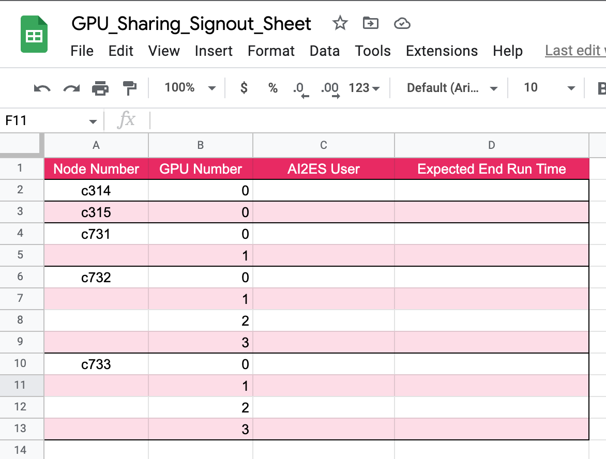

.. _general_gpu_tips:

General GPU Tips
================

++++++++++
Background
++++++++++

Having access to these amazing machines is truly a privelage. Please consider the tips and best practices listed here 
to make sure you are not hogging all the computing time to yourself. 

++++++++++++++++++++++++++
Understanding AI2ES Nodes
++++++++++++++++++++++++++

-------------
Current Setup
-------------

As of 18 Dec 2022, AI2ES has a total of 20 GPUs that we own
and can use. More specifically, we have 2 NVIDIA V100s
(previous generation) and 18 NVIDIA A100s (current generation).

Inside some of these nodes, "NVlink" connects the GPUs together
at high bandwidth (i.e., can share information quickly):

``c314``, ``c315``: single V100 each (32 GB GPU RAM each)

``c731``: dual A100s (40 GB GPU RAM), with NVlink between GPUs (600 GB/sec)

``c732``, ``c733``, ``c829``, ``c830``: quad A100s each (40 GB GPU RAM each), with NVlink between GPUs (600 GB/sec)

______________________
New Schooner Resources
______________________

In addition to the new AI2ES resources, AI2ES project members will also have
access to OSCER-owned GPUs as well (*no date for implementation yet*):

``TBD``: 3 nodes, dual A100s each (40 GB GPU RAM each), NO NVlink (i.e., can't share data across them)

``TBD``: 3 nodes, dual A100s each (80 GB GPU RAM each), with NVlink between GPUs in the same node (600 GB/sec)

Lastly, with these new GPU resources for Schooner, there are plans to obtain the next generation of GPUs (H100s). The current plan is for these to arrive maybe sometime late in 2023. 

.. note::

    Know that the OSCER-owned GPUs will be for general use for all (e.g., the > 1,300 Schooner users). So queue times will likely be much longer than our ai2es nodes. 

+++++++++++++++++++++++
Requesting AI2ES Nodes
+++++++++++++++++++++++

In order to request ANY of the nodes available, add the following line of code to your sbatch file

.. code-block:: console

    #SBATCH -p ai2es

The priorty list for this command will be ``c314``, ``c315``, ``c731``, ``c732`` and then ``c733``. So usually you will
get allocated the V100s first. 

If you want to specifcally get the V100 add the following

.. code-block:: console

    #SBATCH -p ai2es_v100

Alternatively, if you want to specifcally get the A100 add the following

.. code-block:: console

    #SBATCH -p ai2es_a100

If you want to specifcally get the A100 with 2 GPUS do the following

.. code-block:: console

    #SBATCH -p ai2es_a100_2

Or if you want to specifcally get the A100 with 4 GPUS do the following

.. code-block:: console

    #SBATCH -p ai2es_a100_4

+++++++++++++
Sharing GPUs 
+++++++++++++

----------------
Selecting N-GPUs
----------------

Now that you have figured out how to request a gpu node with sbatch, it is important to only use the 
number of GPUs you NEED. A100s are a very valuable GPU and are some of the fastest GPUs out there for 
deep learning. So you could see how requesting all 4 of them at time (for c732 and c733) and only using 1
of them is a waste of computational hours. 

By default, tensorflow will share the memory of your job across all 'visible' GPUs, which is all that are connected 
to the node you are using. Consider the example where your deep learning model only takes up a total of 20 GB of RAM. 
This job would be able to fit entirely on 1 GPU. So a more appropriate use of your job would be to specifically only use 1 GPU, 
not all 4 (or 2 if you are on c731). 

To do this, we will use that pip package `py3nvml <https://github.com/fbcotter/py3nvml>`_ which allows use to select the GPU 
you wish to use. 

.. code-block:: python

    import py3nvml
    py3nvml.grab_gpus(num_gpus=1, gpu_select=[0])
    
The following technique is suggested. Start with n_gpu=1, then if it fails saying not enough memory, then try n_gpu=2 
(you will have to change gpu_select to be [0,1]) and so on. 

If you know you will use ALL of the GPUs attached to a specifc node, you can use the following flag in your sbatch 

.. code-block:: bash 

    #SBATCH --exclusive

This will make sure no one else can use your node or GPUs. Quick note, if you are using ALL of the GPUs you should be doing 
distributed training. If you don't know what distributed training is, your probably don't need it. 

If you are confused by all this, please reach out to me (Randy Chase; randychase 'at' ou 'dot' edu). 

----------------------------
Seeing which GPUs are in use
----------------------------

It might not be clear right now, but because most people only use 1 GPU at a time (per script), it is hard to tell who is using which GPUs. For example, you can use the usual method to check the current usage of the ai2es nodes:

.. code-block:: bash 

    $ squeue -p ai2es,ai2es_v100,ai2es_a100,ai2es_a100_2,ai2es_a100_4

If the resulting output is blank, no one is using the nodes. If there are names listed, it shows you who is using what node and for how long the jobs have been running but it does not tell you how many of the GPUs on any single node (or which specific GPUs they are using). To assure smooth sharing, right now we will use the following 'sign-out' table: 

The link for the table is `here <https://docs.google.com/spreadsheets/d/1L6R-sytmMlWyHTXYRJeHWwWSKdptOM8-YdrOwXOCdQo/edit?usp=sharing>`_, but you will have to email me to get edit access to it. The idea here is that if you plan on running your job for longer than a few hours (e.g, you are not actively debugging), please put your name and when you expect the job to finish in this table. This way others can quickly and easily see who is using which GPUs.

Once you know what nodes/GPUs are free, to select a specific one using slurm you can do the following. Imagine c733, GPU 3 is available. I would have the following line in my SBATCH

.. code-block:: bash 

    #SBATCH -w c733 

This line ensures my job will only get allocated to c733 where I know the GPU is free. Then make sure you add the following to your python script:

.. code-block:: python 

    import py3nvml
    py3nvml.grab_gpus(num_gpus=1, gpu_select=[3])

Then you should be all set. The job should get placed on c733 and GPU 3. Now, if SLURM tells you ``PRIORITY``, then it is likely the other people on the node have consumed all the CPU resources. Each node has about 20 CPU cores and ~ 30 GB of RAM. Try adjusting your following lines

.. code-block:: bash 

    #SBATCH --ntasks=4
    #SBATCH --mem=16G

``--ntasks=4`` will allocated 4 cores to your job and ``--mem=16G`` will allocate 16 GB of RAM. 

---------
Long Jobs 
---------

Even though we have some of the fastest GPUs out there, big deep learning jobs can still take days. As a good
rule of thumb, if you plan to train for more than 24 hours, PLEASE PLEASE PLEASE let other AI2ES memebers know.
It is best to drop a line in the #schooner channel in the ai2es slack, and ask if it is alright you will be using up 
a GPU for over 12 hours.

The main reason behind this is because often times people have deadlines. Consider the frantic PhD student trying to 
finish up their general exam and the come to find out ALL the GPUs are already in use.... yeah not a good scenario. Or 
consider the scientist working on addressing the major reviews on their paper which are due in a couple days. Yeah they
should have preference. 

Currently there is no limit to the number of computational hours any one user can use. I would love to keep it this way. 