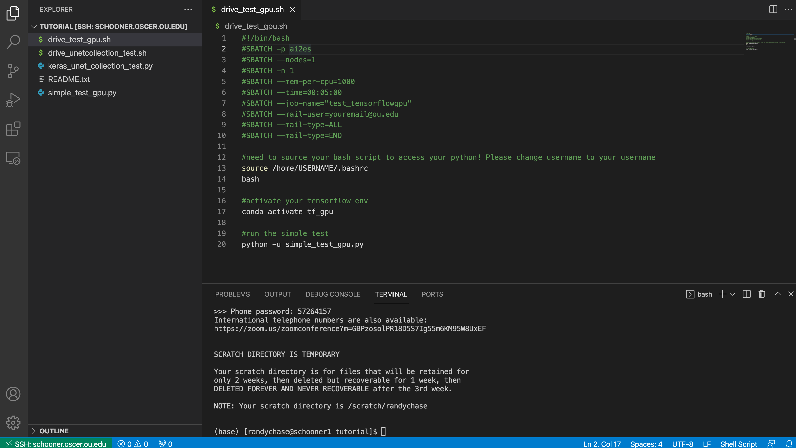

.. _general_hpc_tips:

General HPC Tips
================

++++++++++
Background
++++++++++

This could be your very first time interacting with a high performance computing (HPC) facility. This page is written to help explain some of the HPC nuance.
If you are familiar with HPC systems, feel free to skip this and jump to :ref:`install_tensorflow`

++++++++++++++++++++++
Understanding Schooner
++++++++++++++++++++++

Schooner is a supercomputer, which in plain language is a bunch of computers connected to one another. Now, this is an oversimplification, but helps understand what it is.
If you have ever purchased a computer for yourself, you probably saw random words like "RAM" or "HDD" or "i3". Let's explain some of these words, it will help understand the supercomputer. 

**RAM** is random acces memory which is the amount of data that can be stored in memory. Think of it as a limit to how much data you can load from some file to play with. 

**HDD** is the hard disk, or how much storage space there is. 

**i3** is the type of computer chip the computer has, or also known as the CPU. CPU's nowadays are often 'quadcore' meaning they have 4 cores, and such can do more than one thing at a time (the computer word for this is *tasks*). 
This multi-core style helps your computer open multiple programs or do multiple calculations at the same time.  

When you login to schooner (``ssh -Y username@schooner.oscer.ou.edu``), you will arrive on a *login* node. A node is a computer rack (i.e., think of a desktop tower you might of had back in primary school) with many CPU cores (i.e. computer chips).
These nodes are for tasks like, submitting jobs, copying files, moving files, building scripts. DO NOT RUN CODE ON THE LOGIN NODE. Running code is reserved for the numerous *compute nodes*, which are computer racks who's sole
purpose is to run computations. 

-----------------------
Writing My First Script
-----------------------

How do I run code on the compute nodes? On schooner we use something called SLURM. SLURM is known as a job scheduler. Basically, SLURM is the air traffic controller of the supercomputer. They recieve 
requests to do computing (i.e., flights) and make sure all jobs are properly scheduled by queueing (i.e., puting jobs in a line) up jobs for specific compute nodes (i.e., runways). SLURM files are text files
characterized by a header that has lots of #SBATCH lines in them. Here is an example, where we have the script do the sterotypical 'HelloWorld' task for coding. 

.. code-block:: bash

    #!/bin/bash
    #SBATCH -p debug_5min
    #SBATCH --nodes=1
    #SBATCH -n 4
    #SBATCH --mem 16G
    #SBATCH --time=00:05:00
    #SBATCH --job-name=HelloWorld
    #SBATCH --mail-user=username@university.edu
    #SBATCH --mail-type=ALL
    #SBATCH --mail-type=END
    #SBATCH --output=/home/username/R-%x.%j.out
    #SBATCH --error=/home/username/R-%x.%j.err 

    echo 'Hello World'

A quick breakdown of the parts: 

``#!/bin/bash`` envokes a bash shell, which is a specific style of scripting (a common scripting language). 

``#SBATCH -p debug_5min`` chooses the specific *partition* (-p) or compute nodes to run the script on. This one is requesting the ``debug_5min`` queue, which is a short line where jobs can
not run for more than 5 mins. 

``#SBATCH --nodes=1`` requests that we use 1 node (or one computer rack). Most the time you wont need more than one computer rack. 

``#SBATCH -n 4`` determines how many *tasks* are launched. This is useful for parallel tasks. 

``#SBATCH --mem 16G`` asks for 16 GB of RAM. 

``#SBATCH --time=00:05:00`` sets how long the job should run (5 minutes here)

``#SBATCH --job-name=HelloWorld`` name of the job 

``#SBATCH --mail-user=username@university.edu`` where to send emails about the job status (i.e., running, failed, completed)

``#SBATCH --mail-type=ALL `` & ``#SBATCH --mail-type=END`` which emails to send you, just default to all. 

``#SBATCH --output=/home/username/R-%x.%j.out`` where to put the output file, which is all the code that gets printed to screen. The ``%x`` will copy the job name you provide above, and ``%j`` will copy the jump number assigned by SLURM.

``#SBATCH --error=/home/username/R-%x.%j.err`` where to put the error file, which contains all the errors, if the script failed/errored. Otherwise it will be blank. 

``echo 'Hello World'`` prints Hello World to the out file. 

Most the time this header is enough for jobs, with users just having to alter the above header to meet their needs. 

----------
Partitions
----------

Your script above uses the ``debug_5min`` partition which is a great place to test out code, but can only run for 5 mins. There are many more partitions as you can see on `OSCER <https://www.ou.edu/oscer/support/partitions>`_ , here is a quick list and TL;DR use

1. ``debug_5min`` : short debugging, quick queues (i.e., wait times)
2. ``debug`` : 30 min max debugging sessions. Quick queues, if your job takes less than 30mins, you can just run the job here. 
3. ``normal`` : the general queue for most jobs, max time is 48 hours, queues can be long, but depend on your RAM and CPU requests. In general keep it under ``-n`` 20 and ``-mem`` 28G to get shorter times. 
4. ``large_mem``: large memory, up to  1000 GB or RAM, but VERY long wait times (only a few nodes here). So try to be effcient with your coding. 

The above are likely your most used, but if you want to see more check out `OSCER <https://www.ou.edu/oscer/support/partitions>`_. 

Now these are partitions that ALL schooner users have access to. There is specific AI2ES partitions that ONLY AI2ES folks can use. See Requesting AI2ES Nodes on :ref:`general_gpu_tips`

-----------------------
Running My First Script
-----------------------

Now, the script above is just a text file. Go ahead and save that out. Traditionally, my SLURM files has the .sh ending so I know they are SLURM/BASH files. For example let's name the above script ``HelloWorld.sh``. If you are in a terminal right now, copy the code above
open a text file by typing ``nano HelloWorld.sh`` (nano is a quick and easy text editor, note you CANNOT CLICK here and need to naviate using your keyboard [arrows]). Paste the script in there, make the changes to *username* (otherwise this wont work). To exit, hit control and x then type y to save it.
Now to run the script on a compute node, submit the script using the ``sbatch`` operator. 

.. code-block:: console

    $ sbatch ./HelloWorld.sh

It should spit out something like `Job submitted XXXXX` with some number. This means your job is in the queue.

--------------------------
Monitoring My First Script
--------------------------

In order to see what the status of your script is you will use the ``squeue`` function.

.. code-block:: console

    $ squeue -u USERNAME

type your username above to see all the jobs you have submitted (that are in the queue or are running). You will see something like the following: 

.. image:: images/squeue_example_2.png
   :width: 600
   :align: center

Where it describes various information. The ST column is the status, were R meansing running, PD is paused (i.e., in the queue). If you need to cancel the job
you use the ``scancel`` fuction: 

.. code-block:: console

    $ scancel JOBID

where you use the job number from ``squeue``, so for the above example is 

.. code-block:: console

    $ scancel 8613351

---------------
Disks (Storage)
---------------

On schooner you have 3 main places you can put your scripts and data. They are: 

1. ``/home/USERNAME``

- This is your home directory, where you put your python files and maybe some other scripts/slurm files. NOTE this is only 20 GB so be sure to keep storge here below 20 GB. 
- To check the size of your home do the following (this might take a few mins btw, be patient): 

.. code-block:: console

    $ du -sh ~/

2. ``/ourdisk/hpc/ai2es/``

- This is the storage space for all your data! We have something like 1 PB of space (thats 1,000 TB or 1,000,000 GB of space). This will be your primary work space for all your data and scripts. 
- Please make a directory here with your username as the name 

.. code-block:: console

    $ mkdir /ourdisk/hpc/ai2es/USERNAME

- If you plan on sharing data put it in the `datasets` directory, or if its a shared project, go ahead and make a project directory. 
- NOTE: this is a shared directory, please don't abuse it. 

3. ``/scratch/USERNAME``

- This is a sandbox where you can put data that you don't need to keep. This is a large space, you can put TB of data here, that is deleted every 2 weeks. You will get emails saying files will be deleted. 
- This is helpful for intermidiate files that you don't need to keep. Or say you need to download some large dataset, but will grab only 1 variable out of the total files. Maybe put the full files on scratch and parse it down then put the final files on `/ourdisk/hpc/ai2es/`

+++++++++++++++++++++++++
Interacting with Schooner
+++++++++++++++++++++++++

Below are some quality of life things that help with interacting with Schooner. 

-------
VS code 
-------

Interfacing with Schooner is doable with a simple terminal (terminal in mac, powershell in windows) 
but can be cumbersome to edit files right from the terminal. If you are looking for a more sophisticated 
user interface, I suggest the use of `VS code <https://code.visualstudio.com>`_. The only thing you need to install is the extension called 
Remote SSH. That will allow you to ssh right into schooner, navigate directories with clicks, and also 
save by just doing cmd+s (or cntl +s on windows). Here is a screenshot from my session: 

Please give it a try, you will be happy you did. It is so much nicer to be able to edit, save, view images, run code all from one application. 

---------------------------
Helpful Aliases (shortcuts)
---------------------------

An alias is a shortcut in linux. I am lazy and HATE HATE HATE typing out 'squeue -u randychase' one million times. 
As a work around, you can put the following into your .bashrc located in your home dir. 

.. code-block:: bash

    alias cu="squeue -u USERNAME" <-- change this to your username
    alias cg="squeue -p ai2es,ai2es_v100,ai2es_a100,ai2es_a100_2,ai2es_a100_4"
    alias cs="sinfo -p ai2es,ai2es_v100,ai2es_a100,ai2es_a100_2,ai2es_a100_4"

after adding it, sign out and sign back in. You can now simply see what jobs you are runing by typing:
 
.. code-block:: console 

    $ cu

which is shorthand in my head for 'check user'. 

Or you can check whats running on the AI2ES nodes: 

.. code-block:: console 

    $ cg

which is shorthand in my head for 'check group'. 

The last one is to 'check status', which will tell you if a node is 'down' or broken. 

---------------------
SLURM email managment 
---------------------

When you submit a job to the SLURM job scheduler you can have SLURM send you emails for when the job starts, ends, or fails. This is enabled by the following:

.. code-block:: bash

    #SBATCH --mail-user=username@school.edu 
    #SBATCH --mail-type=ALL 

These emails are helpful to know how long jobs run for, if they succeed etc. As you could imagine though, the number of emails can really add up. Also, if your email makes the alert tone for every email you might be easily distracted. The way around this is to use a second email for the sole purpose of only getting slurm emails. 
This can be done with gmail, since accounts are free. You could try plugging that new email in the code line above, but unfortunately, when I did that messages were not delivered (I think Google's spam filtering kills the SLURM messages). The workaround I have used is to use Outlook's auto forward capability to forward the slurm emails
from my OU account over to my google account. This enables me to have my slurm email to go through the stock mac mail app and my normal email go through Outlook. And the really cool part about this is I like how my slurm emails make a different alert tone than normal emails. It really helps with productiviy. To do this 
look up how to add a 'rule' to your outlook messages, and add in the emails from slurm 'slurm@odin.oscer.ou.edu'. 