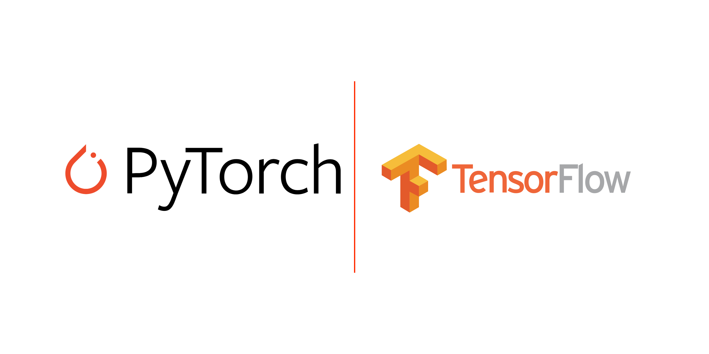
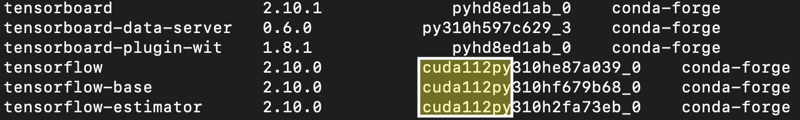

.. _install_tensorflow:

Install Tensorflow/Pytorch
==========================



++++++++++
Background
++++++++++
If you have never tried to get tensorflow/keras/pytorch running with a GPU (not on google colab), 
it often takes a very specific set of packages and libraries installed (e.g., tensorflow 1.15 wants 
a specific CUDA library that is different from the library tensorflow 2.0 wants). Luckily, in the past 
year Anaconda has figured out all the nuances for us. So the reconmended method to getting tensorflow 
install on Schooner is to use Anaconda.

.. note::

    If you need to have an enviroment for both tensorflow and pytorch, please let your supervisor know. We will need to request for more space
    in the home directory to allow you to have both packages.

++++++++++++
Get Anaconda
++++++++++++

If you don’t know what Anaconda (aka conda) is, it is a package manager that will help you install python packages for you! 
If you already have anaconda installed please skip to the install tensorflow section.

A note here, there are 3 ways you can go at this point:

1) conda

- conda is the original way, where you download the entire package solver (including some packages you will likely never use). This method is fine if you have a decent amount of storage space, but the issue with Schooner is we only get 20 GB. Which might seem like alot, but that fills up quickly (lets you have 2-3 envs.).

2) miniconda

- this is a *lite* version of conda. This is a good place to start, but the mamba route is probably better. 

3) mamba

- this is the new method. Mamba (note the snake name) is the same as miniconda and conda, but is written in a parallel way and a faster language. 

The suggested method is mamba, it is fast and smooth. The steps are largely the same, but just change for what package you download. 

---------------
check for space
---------------

First, we have to make sure you have enough disk space on your home directory to install anaconda. From your 
home directory please run the following code (note this might take a min to run)

.. code-block:: console

    $ du -sh ./ 

Note that your home dir only allows for 20 GB of storage, so if you do not have more than 5 GB of storage, please work on cleaning up your home dir. If you are wondering where to put your data, move it to the AI2ES disk. You will have to make a directory on that disk. Please use your username for your dir. **Current envs with just tensorflow is 3.6 GB and pytorch is 6.8 GB**.

.. code-block:: console

    $ mv ./DATA.data /ourdisk/hpc/ai2es/USERNAME/

-----------------
grab install file
-----------------

Now that you have room to install anaconda, go ahead and grab the link (right click, copy link) 
for the latest (for Linux x64):

______
conda 
______

`https://www.anaconda.com/products/distribution <https://www.anaconda.com/products/distribution>`_

__________
miniconda
__________

`https://docs.conda.io/en/latest/miniconda.html <https://docs.conda.io/en/latest/miniconda.html>`_

_______
mamba
_______

`https://github.com/conda-forge/miniforge#mambaforge <https://github.com/conda-forge/miniforge#mambaforge>`_

Use wget to get the file. Example is here: 

.. code-block:: console

    $ wget https://github.com/conda-forge/miniforge/releases/latest/download/Mambaforge-Linux-x86_64.sh

Change permissions so you can run the install file you just downloaded 

.. code-block:: console

    $ chmod u+x Mambaforge-Linux-x86_64.sh

Install your choice (follow instructions miniconda tells you after running the following code)

.. code-block:: console

    $ ./Mambaforge-Linux-x86_64.sh


Click through the prompts, and at the end of installation say 'yes'. In order to make sure it worked, it is probably best to exit (leave schooner) and sign back in. When you sign back in, it should say 'base'.

.. image:: images/base_console.png
   :width: 300

Congrats! We now have all the pieces in place to install tensorflow 

.. note::

    Before installing any-other packages, please get into the habit of making an environment first. That way, if anything breaks in that environment, you can delete just the env, and not your whole anaconda. 
    
Here we will make an environment for tensorflow (if you used miniconda or conda replace mamba with conda, and if you install pytorch change the name of tf-gpu to torch)

.. code-block:: console

    $ mamba create --name tf_gpu

Activate env 

.. code-block:: console

    $ mamba activate tf_gpu

.. note::

   Quick important note on what `-c conda-forge` means. So this is a channel that has packages that all seem to 
   work together better. In my experience ALWAYS use this flag when installing packages. Another note on packages,
   try to always stick with mamba/conda installing things. Mixing pip and conda installs can make things messy. 
   Use pip if you must, but try not to.

+++++++++++
Tensorflow
+++++++++++

Okay, now we are ready to finally install `Tensorflow <https://www.tensorflow.org>`_. There is one key trick we need to do though. So when you logged in
you are located on the `login node`. This node does not show that we have GPUs. Why this is important is because tensorflow
needs a VERY specific version of its package to match with the software that runs with the GPUs. So, if you want to use the 
GPUs and dont want to go hunting for software libraries, you will need to install tensorflow using a script submitted to 
our AI2ES nodes. 

To do this, go grab my template script here 

.. code-block:: console

    $ cp /ourdisk/hpc/ai2es/shared/tutorial/install_tf.sh

or you can copy the code from here: 

.. code-block:: bash

    #!/bin/bash
    #SBATCH -p ai2es
    #SBATCH --nodes=1
    #SBATCH -n 4
    #SBATCH --mem 16G
    #SBATCH --time=01:00:00
    #SBATCH --job-name=tf_install
    #SBATCH --mail-user=username@university.edu <-- change this!
    #SBATCH --mail-type=ALL
    #SBATCH --mail-type=END
    #SBATCH --output=/home/username/R-%x.%j.out <-- change this!
    #SBATCH --error=/home/username/R-%x.%j.err <-- change this!

    #need to source your bash script to access your python!
    source /home/username/.bashrc #<-- change this to your username!
    bash

    #activate your tensorflow env
    mamba activate tf_gpu #<-- change this if you have a different name

    #use mamba to install tensorflow with the right GPU stuff
    mamba install -c conda-forge -y tensorflow

Please change the lines I pointed out and delete my `<-- change this`. Otherwise slurm will get mad. 

Now that you have the updated script we can submit it 

.. code-block:: console

    $ sbatch ./install_tf

Wait for the job to finish. You can either wait for the email, or you can check up on it with 

.. code-block:: console

    $ squeue -u username

if you put YOUR username in. It should show you what jobs you have running. 

.. note ::

    ``squeue`` is one of my most repreated commands. I am lazy and hate typing out ``squeue -u username`` I have made some helpful aliases (e.g., shortcuts) that shorten this command. Check out Interacting with Schooner on :ref:`general_hpc_tips`. 

Once it is done running, check the .err file to make sure there were no errors. If not, go ahead and check to make sure it worked! Open a quick python session and import tensorflow. This will take about a min for the first time importing tensorflow. 

.. code-block:: console

    $ python 
    >>> import tensorflow as tf    

If it is installed properly, there shouldnt be any import errors. There might be a warning saying "hey no GPUs found" but thats okay. 

Now, that just proved we have tensorflow installed. We need to check that the GPU version works. The first thing to check is the version. This can be done with listing the conda packages 

.. code-block:: console

    $ mamba list

this should print out a list of all the installed packages. Scroll to tensorflow (it should be alphabetical) and look what version is installed. You are looking for something that says ```cuda``` if it doesnt say cuda, you likely got the cpu version only. Here is an example of my tensorflow



Now that we have a cuda version of tensorflow, to actually test to see if we can properly use it, please proceed to :ref:`test_gpu`.

.. note::

    You can install other packages from the login node. But if you have to install other packages, Please please please make sure conda/mamba doesn't change this tensorflow version to a non-gpu version. Otherwise you might be confused why your model is taking so long to train. 

++++++++
PyTorch
++++++++

To get `PyTorch <https://pytorch.org/get-started/locally/>`_ I followed the link. The key here is to know what version of CUDA is installed on the GPUs. As of today (02 Dec 2022) CUDA 11.7 is installed on the GPUs.

Like tensorflow, first make a new env first 

.. code-block:: console

    $ mamba create --name torch

activate that env 

.. code-block:: console

    $ mamba activate torch

Install pytorch with the right cuda version 

.. code-block:: console

    $ mamba install pytorch torchvision torchaudio pytorch-cuda=11.7 -c pytorch -c nvidia

This will take a min. 

Let's test to make sure it worked. 

.. code-block:: console

    $ python 
    >>> import torch

If it is installed properly, there shouldnt be any import errors.

To actually test to see if we can properly use the GPU, please proceed to :ref:`test_gpu`.

+++++++++++++++++++++++
One additional package
+++++++++++++++++++++++

We need to install 1 more package that will be needed to share the GPUs across users. So please do the following line 

.. code-block:: console

    $ pip install py3nvml

This package will help in selecting a GPU for use by just you. This helps with memory managment and sharing the GPUs. 

From here its best to proceed to :ref:`test_gpu`. 