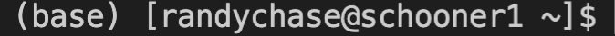

Install Tensorflow
===================

++++++++++
Background
++++++++++
If you have never tried to get tensorflow/keras/pytorch running with a GPU (not on google colab), 
it often takes a very specific set of packages and libraries installed (e.g., tensorflow 1.15 wants 
a specific CUDA library that is different from the library tensorflow 2.0 wants). Luckily, in the past 
year Anaconda has figured out all the nuances for us. So the reconmended method to getting tensorflow 
install on Schooner is to use Anaconda.

++++++++++++
Get Anaconda
++++++++++++

If you don’t know what Anaconda is, it is a package manager that will help you install python packages for you! 
If you already have anaconda installed please skip to the install tensorflow section.

First, we have to make sure you have enough disk space on your home directory to install anaconda. From your 
home directory please run the following code (note this might take a min to run)

.. code-block:: console

    $ du -sh ./ 

Note that your home dir only allows for 20 GB of storage, so if you do not have more than 5 GB of storage, 
please work on cleaning up your home dir. If you are wondering where to put your data, move it to the AI2ES disk. 
You will have to make a directory on that disk. Please use your username for your dir. 

.. code-block:: console

    $ mv ./DATA.data /ourdisk/hpc/ai2es/USERNAME/

Now that you have room to install anaconda, go ahead and grab the link (right click, copy link) 
for the latest miniconda distribution (for Linux x64) `here <https://docs.conda.io/en/latest/miniconda.html>`_. I use miniconda because it is lighter 
(i.e., takes up less disk space). Use wget to get the file

.. code-block:: console

    $ wget https://repo.anaconda.com/miniconda/Miniconda3-latest-Linux-x86_64.sh

Change permissions so you can run the install file you just downloaded 

.. code-block:: console

    $ chmod u+x Miniconda3-latest-Linux-x86_64.sh

Install miniconda (follow instructions miniconda tells you after running the following code)

.. code-block:: console

    $ ./Miniconda3-latest-Linux-x86_64.sh

Double check it worked. 

.. code-block:: console

    $ bash 

After running the command bash, you should see the word ‘base’ like this: 

Congrats! We now have all the pieces in place to install tensorflow 

++++++++++++++
Get Tensorflow
++++++++++++++

Before installing any-other packages, please get into the habit of making an environment first. 
That way, if anything breaks in that environment, you can delete just the env, and not your whole anaconda

Here we will make an environment for tensorflow 

.. code-block:: console

    $ conda create --name tf_gpu

Activate env 

.. code-block:: console

    $ conda activate tf_gpu

Now we want to install mamba, a much faster package solver than conda. 

.. code-block:: console

    $ conda install mamba -n base -c conda-forge

Okay, now that we have mamba we are ready to install tensorflow. This is awesome
because conda/mamba will automatically look for which tensorflow version your 
machine can handle. The issue is, you are currently on the login node, where
there are no GPUs avail. So conda/mamba will say "hey you dont have a gpu" and 
not work. As a work around, go grab the `install_tf.sh` script from our tutorial 
folder

.. code-block:: console

    $ cp /ourdisk/hpc/ai2es/shared/tutorial/install_tf.sh ./

Then edit this file to have your info (emails/usernames). To do this you 
can use nano, or any text editor of your choice. 

.. code-block:: console

    $nano ./install_tf.sh 

This is what you will see: 

.. code-block:: bash
 
    #!/bin/bash
    #SBATCH -p ai2es
    #SBATCH --nodes=1
    #SBATCH -n 4
    #SBATCH --mem 16G
    #SBATCH --time=01:00:00
    #SBATCH --job-name=tf_install
    #SBATCH --mail-user=username@university.edu <-- change this!
    #SBATCH --mail-type=ALL
    #SBATCH --mail-type=END

    #need to source your bash script to access your python! 
    source /home/username/.bashrc <-- change this to your username!
    bash

    #activate your tensorflow env
    conda activate tf_gpu 

    #use mamba to install tensorflow with the right GPU stuff 
    mamba install tensorflow-gpu -c conda-forge

Okay, now that you updated the script with your info, go ahead and submit the job. 

.. code-block:: console

    $ sbatch ./install_tf.sh

This will take a few minutes so be patient and either wait for the email saying
its done, or monitor the .out file. 

Once you get confirmation it worked, let's do a quick test. Re-source your conda 

.. code-block:: console

    $ bash 
    $ conda activate tf_gpu 

Now, open a quick python session and import tensorflow. This 
will take about a min for the first time importing tensorflow.

.. code-block:: console

    $ python 
    >>> import tensorflow as tf    

If it is installed properly, there should be no errors or output, should just go to a new blank line of code. 

We need to install 1 more package that will be needed to share the GPUs across users. So please do the following line 

.. code-block:: console

    $ pip install py3nvml

Hooray! You have installed tensorflow-gpu! To test it go to the page titled "Test GPU"
