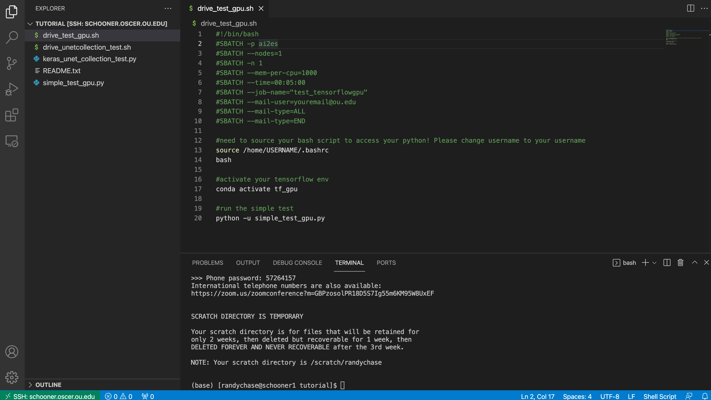

.. _other_tips:

Other Tips
===================

+++++++++++++++
Helpful Aliases 
+++++++++++++++

An alias is a shortcut in linux. I am lazy and HATE HATE HATE typing out 'squeue -u randychase' one million times. 
As a work around, you can put the following into your .bashrc located in your home dir. 

.. code-block:: bash

    alias cu="squeue -u USERNAME" <-- change this to your username
    alias cg="squeue -p ai2es,ai2es_v100,ai2es_a100,ai2es_a100_2,ai2es_a100_4"
    alias cs="sinfo -p ai2es,ai2es_v100,ai2es_a100,ai2es_a100_2,ai2es_a100_4"

after adding it, sign out and sign back in. You can now simply see what jobs you are runing by typing:
 
.. code-block:: console 

    $ cu

which is shorthand in my head for 'check user'. 

Or you can check whats running on the AI2ES nodes: 

.. code-block:: console 

    $ cg

which is shorthand in my head for 'check group'. 

The last one is to 'check status', which will tell you if a node is 'down' or broken. 

+++++++
VS code 
+++++++

Interfacing with Schooner is doable with a simple terminal (terminal in mac, powershell in windows) 
but can be cumbersome to edit files right from the terminal. If you are looking for a more sophisticated 
user interface, I suggest the use of `VS code <https://code.visualstudio.com>`_. The only thing you need to install is the extension called 
Remote SSH. That will allow you to ssh right into schooner, navigate directories with clicks, and also 
save by just doing cmd+s (or cntl +s on windows). Here is a screenshot from my session: 

