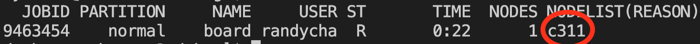

Tensorboard
===================

+++++++++++++++++++
What is tensorboard 
+++++++++++++++++++

For probably 99% of all neural networks, a hyperparameter search is needed. Things like the number of neurons,
then number of layers, the optimizer, the regularization etc. all need to be varied if you wish to get the best
performing model. This can quickly become cumbersome (given how quickly permuations grow). 

While one can go ahead, and save out all the training curves themselves, then after that plot them all yourself,
the people at tensorflow/google have made a useful tool to help use visualize training curves (while training!) in 
a nice interative GUI. This GUI is called [tensorboard](https://www.tensorflow.org/tensorboard). 

What this should allow you to do, is quickly find the best performing models in your hyperparameter search 
without having to load the data yourself in numpy/matplotlib. Plus, it is fun to watch how your models are doing. 

Before you go ahead and follow this guide, you need some logs that are generated by tensorflow. To do this you must 
provide your ``model.fit`` line of code the tensorboard callback: ``tf.keras.callbacks.TensorBoard``. An example is like this:

.. code-block:: python

    callback = tf.keras.callbacks.TensorBoard(
        logdir,
        update_freq='epoch',
        profile_batch=0,  # workaround for issue #2084
    )

++++++++++++++++++++
Check your conda env 
++++++++++++++++++++

By default, if you have a tensorflow environment you should already have tensorboard installed. To check do the 
following code in the schooner terminal

.. code-block:: console

    $ conda activate tf_gpu

If you do not have tensorflow, please go read this :ref:`install_tensorflow`.

+++++++++++++++
Run tensorboard 
+++++++++++++++

Now that you verified that you have tensorboard installed, if you didnt copy all the files in my tutorial folder (used here: :ref:`test_gpu`)
step, go grab the script to launch your tensorboard. 

.. code-block:: console

    $ cp /ourdisk/hpc/ai2es/randychase/tutorials/launch_board.sh 

or you can copy the script here

.. code-block:: bash

    #!/bin/bash
    #SBATCH --partition=normal
    #SBATCH --nodes=1
    #SBATCH --ntasks=1
    #SBATCH --mem=4G
    #SBATCH --time=08:00:00 
    #SBATCH --job-name=board
    #SBATCH --mail-user=username@ou.edu
    #SBATCH --mail-type=ALL
    #SBATCH --output=/home/username/slurmouts/R-%x.%j.out
    #SBATCH --error=/home/username/slurmouts/R-%x.%j.err

    #source you python env
    source /home/username/.bashrc

    bash 

    conda activate board

    tensorboard --logdir="/PATH/TO/LOGS" --port=XXXX --bind_all

You will need to update your username, the path to where your tensorboard logs are and 
the port number you wish to use. The port can be any number between 6006 and 6106. So if it says it is 
already in use, try a different number. But keep track of that port number, because we will need it later! 

After the changes, go ahead and submit the job to run, if you notice queue times are long you can 
reduce the time of the job (this usually speeds up your waiting time). 

.. code-block:: console

    $ sbatch launch_board.sh 

Wait for the job to start, you can do this by checking 

.. code-block:: console

    $ squeue -u USERNAME 
 
or by watching your emails you set up in the SBATCH. Once it begins take a note of the node it is running on (circled below)

we need to combine this number with the port number you chose above (the 60XX number). We need to now tunnel from our local machine into that node. 
From your terminal (either powershell in PC or just terminal in mac/linux) do the following: 

.. code-block:: console

    $ ssh -N -f -L PORT:cXXX:PORT USERNAME@schooner.oscer.ou.edu

Enter you schooner password and no additional message should pop up. From here you can open your browser to the following address

Then there ya go! It should populate and begin working once you fill the logs. 

In the event your machine says that the port number you chose is alread in use, you can kill old port forwarding doing the following. 

This first code asks for the job numbers that are using the port you wanted

.. code-block:: console

    $ lsof -i tcp:PORT

remember, replace PORT with you 4 digit port number you chose above. 

You should see something like this: 

To kill the port, grab the PID number above and then run the following: 

.. code-block:: console

    $ kill -9 PID

That should kill the tunnel. Then you can re-do the tunnel command from above (the ssh -N thing)
